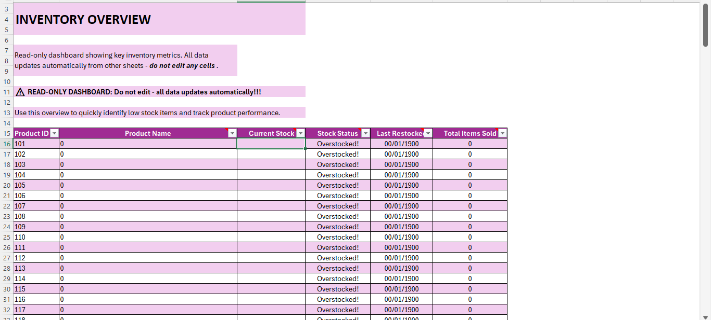

# Excel Inventory & Sales Tracker Template

## Introduction

Managing inventory and tracking sales are vital to the smooth operation of any retail business. 
This Excel template provides a streamlined, beginner-friendly tool for recording sales transactions and purchases, calculating stock levels, and generating inventory summaries, all using Excel’s built-in functions and logic.

## Problem Statement

Most small businesses don’t have the time, budget, or interest to learn inventory management software.  
Additionally, poor tracking can lead to stockouts, over-ordering, and missed sales opportunities.

I built this template to solve that, using only Excel.

## What This Template Helps You Do

- Log and organize sales + restocks across multiple products  
- Automatically update current stock levels  
- Quickly see low/out-of-stock products  
- Keep everything tidy and in one place

## Skills Demonstrated

- Advanced Excel formula design (`SUMIFS`, `IFERROR`, `LOOKUP`, `MAX`, `COUNTIF`)  
- Table structuring and data normalization  
- Dynamic referencing and cross-sheet automation  
- Clean layout design for usability and scalability

## Sheets Overview

### 1. **Product Catalog**
The Product Catalog sheet serves as the master list for all products in your inventory. It captures essential details such as:
* Product ID: A unique identifier automatically generated for each product. This ensures accurate tracking across all sheets.
* Product Name: The name of the product as it appears in your inventory and sales records. Must be entered manually.
* Cost Price: The amount you paid to acquire the product. Useful for profit and margin analysis. Enter manually.
* Selling Price: The price at which the product is sold to customers. This is used to calculate revenue and profitability. Enter manually.
* Product Category: Selected via a dropdown list linked to a category table. Helps group products for reporting and analysis.

  

### 2. **Sales Tracker**
The Sales Tracker is used to record every sales transaction. This sheet feeds directly into inventory and overview calculations.
* Date: The date the sale occurred.
* Product Name: Selected via data validation from the Product Catalog. Ensures consistency.
* Quantity Sold: Number of units sold. Entered manually.
* Unit Price: Price per unit at the time of sale. Entered manually in case of price changes.
* Total Sales Amount: Automatically calculated as Quantity Sold × Unit Price.

### 3. **Purchase Tracker**
The Purchase Tracker is used to track all incoming stock through purchases or restocks.
* Date: The date of the purchase or restock.
* Product Name: Selected from a data validation list tied to the Product Catalog.
* Quantity Purchased: The number of units added to stock. Entered manually.
* Unit Cost: The cost per unit for that purchase. Entered manually.
* Total Cost: Automatically calculated as Quantity Purchased × Unit Cost.

  

### 4. **Inventory Tracker**
The Inventory Tracker calculates the running stock levels per product based on sales and purchases.
* Product Name: Selected via data validation from the Product Catalog.
* Initial Stock: The opening stock value before tracking began. Entered manually.
* Purchased Quantity: Total quantity purchased. Automatically calculated from the Purchase Log.
* Sold Quantity: Total quantity sold. Automatically calculated from the Sales Log.
* Current Stock: Calculated as Initial Stock + Purchased Quantity - Sold Quantity.

### 5. **Inventory Overview**
The Inventory Overview is a  read-only dashboard-style sheet that summarizes key product and stock metrics.
* Product ID: Automatically pulled from the Product Catalog.
* Product Name: Auto-filled from the Product Catalog.
* Current Stock: Reflects the latest stock quantity per product. Auto-calculated.
* Stock Status: Indicates if the product is In Stock, Low Stock, or Out of Stock based on predefined thresholds.
* Last Restocked: Date of the most recent stock update for each product. Auto-generated from the Purchase Log.
* Total Items Sold: Cumulative quantity sold for each product. Auto-calculated from the Sales Log.

 
  

##  How to Use the Template

1. **Download the `.xlsx` file**  on your PC
2. Fill out the **Product Catalog** with your product names and starting stock
3. Log sales in the **Sales Log** and purchases in the **Purchase Log**
4. Review stock levels and product movement in the **Inventory Tracker**
5. Monitor business performance using the **Overview Sheet**

## Recommended For

- Retail shops  
- Market vendors  
- E-commerce stores  
- Mini-marts or kiosks  
- Small NGOs with physical inventory

## Author & Credits

**Created by:** Sophie Umanah  
📧 For support/customization: [Sophieumanah@gmail.com]  
🔗 Connect: [LinkedIn](https://www.linkedin.com/in/umanah-enobong-4226851a3/) | [TikTok](https://www.tiktok.com/@sophiiumanah?_t=ZM-8w7riF8w5) 

